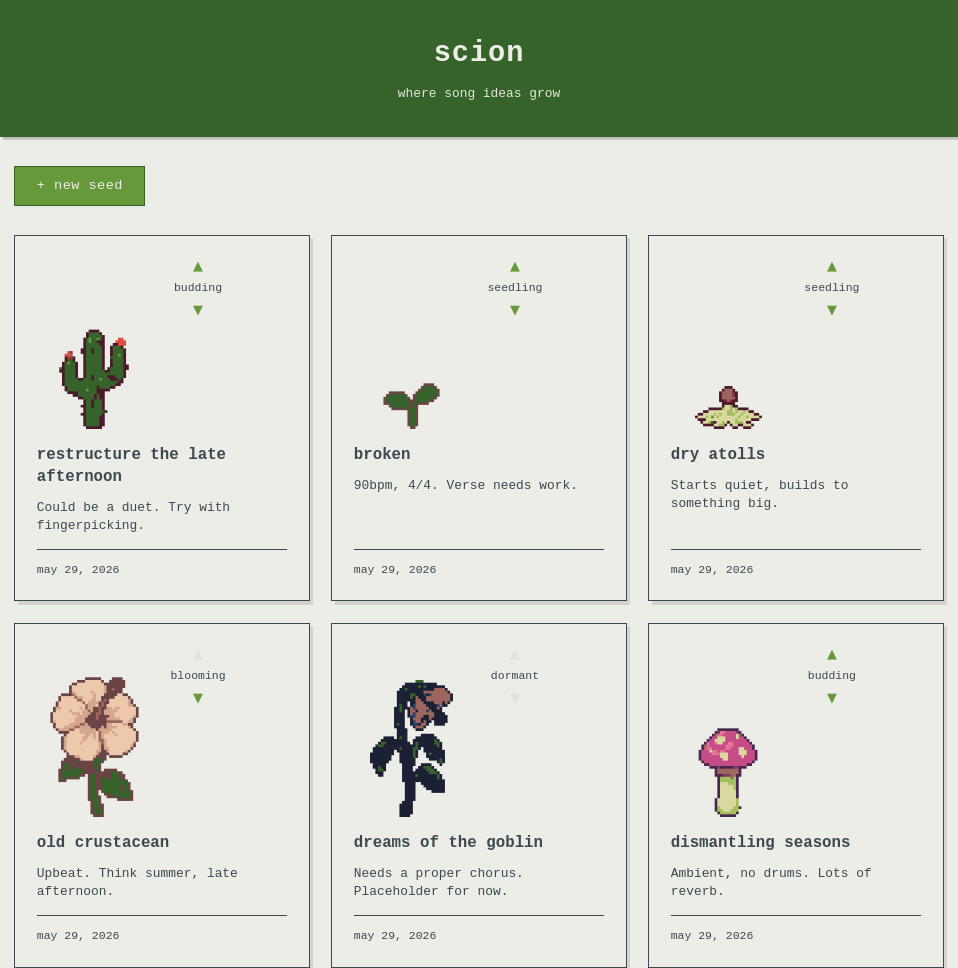

# Scion

A personal creative sketchbook for musical fragments. Song ideas are represented as plants — living things you can tend and develop over time.



For product vision, design decisions, and future ideas, see [VISION.md](./VISION.md).

## Tech stack

- **Frontend**: React + TypeScript + Vite
- **Backend**: Node.js + Express + tRPC
- **Validation**: Zod (shared between client and server)
- **Database**: SQLite via better-sqlite3 (raw SQL, no ORM)
- **Package manager**: Yarn
- **Test runner**: Vitest

## Project structure

```
scion/
  src/
    client/    # React + TypeScript + Vite frontend
    server/    # Express + tRPC backend
    shared/    # Zod schemas and shared types
  data/        # gitignored — SQLite database and audio files
  migrations/  # Numbered .sql migration files
  scripts/     # Development utilities
  cycles/      # Cycle planning documents
```

## Getting started

```bash
yarn install
yarn migrate   # apply pending DB migrations
yarn dev       # start client + server concurrently
```

Client: `http://localhost:5173` — tRPC server: `http://localhost:3000`

## Common commands

```bash
yarn test        # run all tests
yarn type-check  # TypeScript without emitting
yarn lint        # ESLint
yarn format      # Prettier
yarn build       # production bundle
yarn seed        # create 20 test songs via tRPC (requires yarn dev)
yarn clear       # delete all songs via tRPC (requires yarn dev)
```

## Migrations

Add a file to `migrations/` named `NNN_description.sql`, then run `yarn migrate`. Migrations are append-only — no down migrations.
